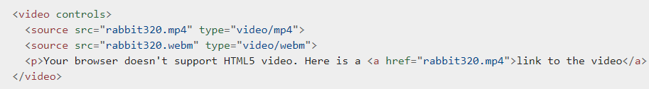

# Read11

## HTML

### Images

#### I learned from this chapter:

1. controlling the size of images in CSS
1. Aligning images using CSS
1. Centering images using CSS
1. Repeating Images
1. Background Position
1. image Rollovers and sprites
1. background-image Gradients

### Practical Information

#### I learned from this chapter:

1. Search Engine Optimization (SEO)
1. SEO is often split into two areas: on-page techniques and off-page techniques.
   - on-page techniques:
     - looking at keywords that people are likely to enter into a search engine
     - Ensuring that any images have appropriate text in the value of their alt attribute also helps search engines understand the content of images.
   - off-page techniques:
     - Search engines help determine how to rank your site by looking at the number of other sites that link to yours.
     - Search engines also look at the words between the a tag in the link.
1. seven key places where keywords can appear in order to improve its findability.
   - page title
   - URL - web address
   - headings
   - text
   - link text
   - image alt text
   - page descriptions
1. Analytics: Learning about your Visitors using Google Analytics.
1. How Many People Are Coming to Your Site
1. What Are Your Visitors Looking At
1. Where Are Your Visitors Coming From
1. In order to put your site on the web you will need a domain name and web hosting
1. To transfer your code and images from your computer to your hosting company, you use something known as File Transfer Protocol (FTP).

### Article [HTML5 video and audio](https://developer.mozilla.org/en-US/docs/Learn/JavaScript/Client-side_web_APIs/Video_and_audio_APIs)

#### I learned from this article

1.The video and audio elements allow us to embed video and audio into web pages.

1. attribute controls, which enables the default set of playback controls. If you don't specify this, you get no playback controls
1. The HTMLMediaElement API
1. creating simple video and audio players

### Flash

#### I learned from this chapter:

1. Flash has been a very popular tool for creating animations, and later for playing audio and video on websites.
1. the first major players to provide web animation, audio, and video.
